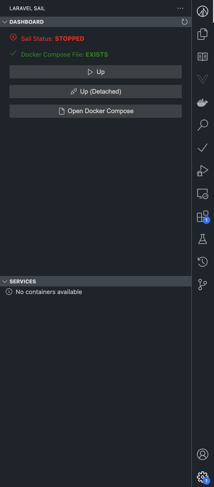
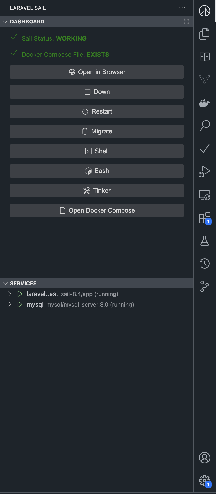

# Laravel Sail for VSCode


A Visual Studio Code extension that provides a seamless integration with Laravel Sail, allowing you to manage your Docker containers directly from VSCode.

## Screenshots




## Features

### 📊 Dashboard View
- Real-time container status monitoring
- Quick access to container controls
- Visual representation of running services

### 🛠 Service Management
- View all Laravel Sail services in a tree view
- Real-time status updates for each container
- Container operations:
  - Start/Stop containers
  - Pause/Unpause services
  - View container statistics
  - Kill containers when needed
  - Restart services

### 🔧 Development Tools
- Quick access to Laravel Sail shell
- Integrated Laravel Tinker console
- View and manage Laravel routes
- Direct access to container bash

### 🚀 Quick Commands
All commands are accessible through the command palette (`Ctrl+Shift+P` / `Cmd+Shift+P`):
- `Laravel Sail: Shell` - Open shell in container
- `Laravel Sail: Bash` - Open bash in container
- `Laravel Sail: Tinker` - Open Laravel Tinker
- `Laravel Sail: Down` - Stop all containers
- `Laravel Sail: Restart` - Restart containers
- `Laravel Sail: Open` - Open application in browser

## Requirements

- Visual Studio Code v1.96.0 or higher
- Docker installed and running
- Laravel project with Sail installed
- WSL2 (for Windows users)

## Installation

1. Open VSCode
2. Launch Quick Open (Ctrl+P / Cmd+P)
3. Run the following command:
   ```
   ext install laravel-sail
   ```

## Extension Settings

This extension contributes the following settings:

- `laravelSail.phpPath`: Path to PHP executable (default: "php")
- `laravelSail.sailPath`: Path to Sail executable (default: "./vendor/bin/sail")
- `laravelSail.composerPath`: Path to Composer executable (default: "composer")
- `laravelSail.artisanPath`: Path to Artisan executable (default: "artisan")
- `laravelSail.checkInterval`: Interval to check sail status in milliseconds (default: 5000)

## Usage

1. Open your Laravel project in VSCode
2. Click on the Laravel Sail icon in the activity bar
3. Use the dashboard to manage your containers
4. Access commands through:
   - Command palette
   - Context menus in the Services view
   - Dashboard buttons

## Features in Detail

### Container Dashboard
- Visual overview of all running containers
- Quick access buttons for common operations
- Real-time status updates

### Services View
- Tree view of all services defined in your Sail configuration
- Context menu for service-specific operations
- Status indicators for each service

### Container Operations
Each container can be managed with operations:
- **Start**: Launch a stopped container
- **Stop**: Stop a running container
- **Pause/Unpause**: Temporarily suspend container operations
- **Kill**: Force stop a container
- **Stats**: View container resource usage
- **Shell Access**: Direct terminal access to containers

## Troubleshooting

### Windows Users
- Ensure WSL2 is properly installed and configured
- Docker Desktop must be running with WSL2 backend

### Common Issues
- If containers aren't showing up, check if Docker is running
- For permission issues, ensure proper Docker configuration
- WSL2 is required for Windows users

## Contributing

Contributions are welcome! Please feel free to submit a Pull Request.

## License

This extension is licensed under the [MIT License](LICENSE).

## Credits

Laravel Sail is a light-weight command-line interface for interacting with Laravel's default Docker development environment. This extension aims to make it even easier to use Sail within VSCode.
